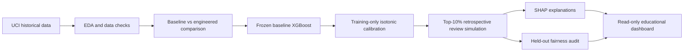
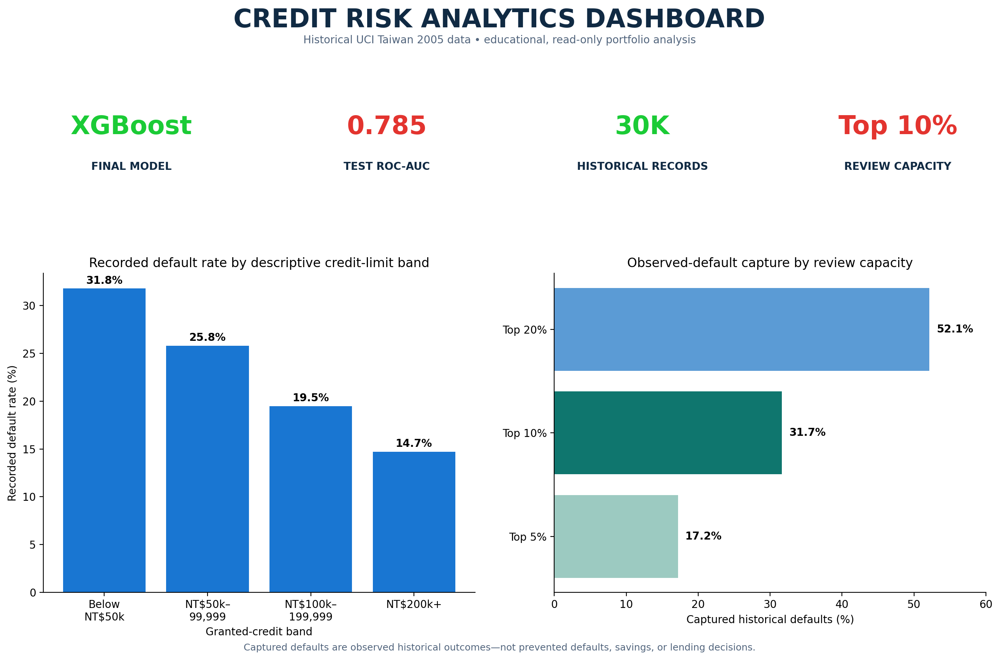
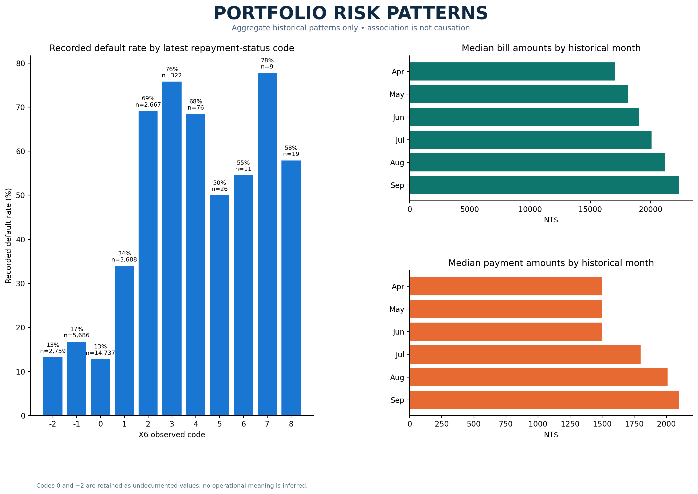
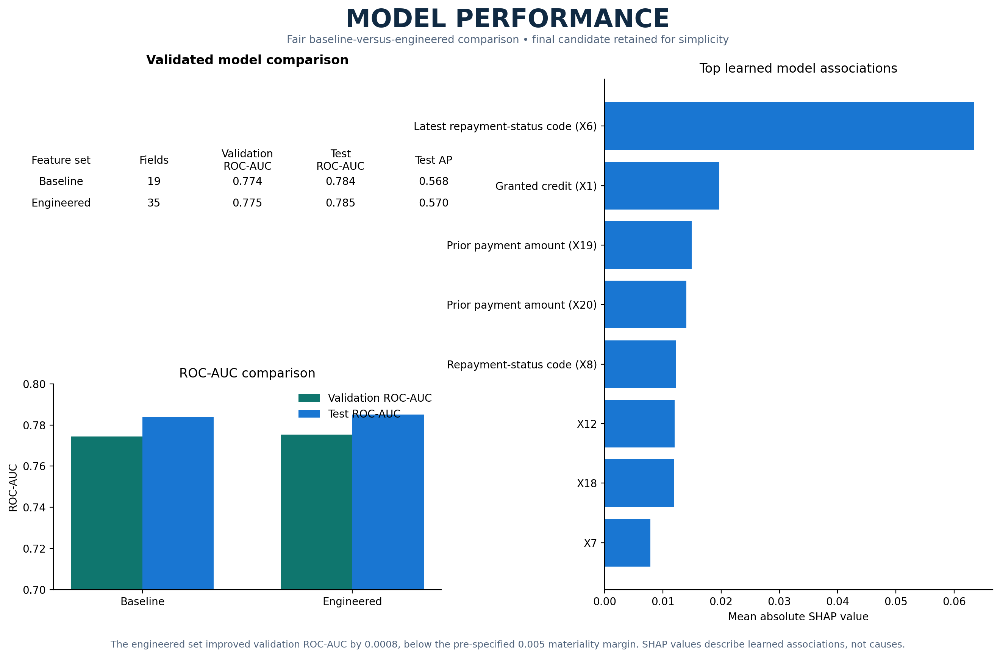
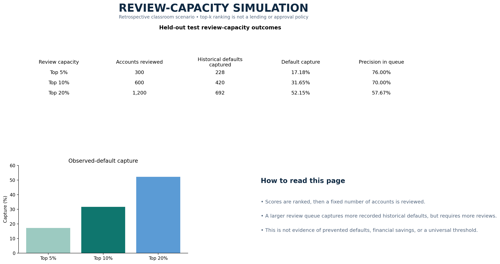

# Credit Risk Analytics & Explainable Default Prediction

An educational credit-risk prototype that ranks historical credit-card accounts for a simulated limited manual-review queue, then documents calibration, explainability, and subgroup-audit limits.

### ▶ [Open the live dashboard](https://credit-risk-analytics-explainable-default-prediction-uxecbcwqu.streamlit.app)

[](https://credit-risk-analytics-explainable-default-prediction-uxecbcwqu.streamlit.app)
[](requirements.txt)
[](tests/test_project.py)

> Educational, retrospective analysis only. It is not a lending, approval, rejection, pricing, collections, or production decision system.

## Verified headline results

Final candidate: frozen baseline XGBoost using `X1` and `X6`-`X23`, with training-only isotonic calibration and a retrospective top-10% review-capacity demonstration.

| Held-out test measure | Verified result |
| --- | ---: |
| ROC-AUC | 0.7848 |
| Average precision | 0.5667 |
| Brier score | 0.1330 |
| Top-10% historical default capture | 31.65% |
| Accounts reviewed in the simulation | 600 of 6,000 |
| Observed defaults captured | 420 of 1,327 |

Captured defaults are known historical outcomes in the held-out test data. They are **not** prevented defaults, savings, or real-world impact.

## Workflow



## Dataset and scope

Source: [UCI Default of Credit Card Clients, dataset 350](https://archive.ics.uci.edu/dataset/350/default+of+credit+card+clients), Yeh and Lien (2009), CC BY 4.0.

- 30,000 historical Taiwan credit-card records.
- Monetary values are in New Taiwan dollars (NT$).
- Repayment, bill, and payment history covers April-September 2005.
- Target `Y`: recorded default payment next month (`1` = yes, `0` = no).
- The raw CSV is intentionally gitignored. Download it from UCI and place it at `data/raw/default_credit_card_clients.csv` before running analysis scripts.

This dataset is not current customer data, Indian banking data, or a real bank portfolio. Its default definition does not provide a modern operational days-past-due rule.

## Methodology

1. **EDA and data quality** - verified schema, missingness, duplicate IDs, target balance, distributions, and historical portfolio patterns. Codes `0` and `-2` in repayment status remain undocumented rather than being assigned a guessed meaning.
2. **Model comparison** - compared dummy classifier, logistic regression, and XGBoost with the same stratified 60/20/20 split (`random_state=42`). The engineered set did not clear the pre-specified 0.005 validation ROC-AUC materiality margin, so the simpler baseline remained final.
3. **Calibration** - compared uncalibrated, sigmoid, and isotonic probabilities with training-only calibration. Isotonic was selected on validation Brier score (ECE as tie-breaker).
4. **Review-capacity simulation** - used a fixed ranked top-k queue, not a universal 0.50 business rule. Cost examples are classroom sensitivity scenarios only.
5. **Explainability** - used approximate model-agnostic Kernel SHAP because installed TreeExplainer cannot parse the saved XGBoost 3.2.0 format. SHAP values are learned associations, not causes.
6. **Fairness audit** - kept `X2`-`X5` out of training, calibration, SHAP, thresholds, and ranking; used them only as held-out audit labels. The audit flags differences for investigation and does not certify fairness.

## Project structure

```text
.
├── app.py                         # Read-only Streamlit dashboard
├── notebooks/
│   └── 01_explore_data.ipynb       # Canonical beginner-friendly EDA notebook
├── src/
│   ├── data_loading.py             # Checked raw-data loading
│   ├── features.py                 # Frozen and engineered feature definitions
│   ├── train.py                    # Baseline training workflow
│   ├── compare_feature_sets.py     # Fair baseline/engineered experiment
│   ├── calibration_threshold_analysis.py
│   ├── explain.py                  # Approximate Kernel SHAP workflow
│   ├── fairness_audit.py           # Held-out subgroup audit
│   └── dashboard_artifacts.py      # Read-only dashboard artifact loader
├── reports/
│   ├── figures/                    # Saved EDA, performance, SHAP, and audit visuals
│   ├── model_card.md
│   ├── calibration_threshold_report.md
│   ├── shap_explainability_report.md
│   └── fairness_audit_report.md
├── tests/
│   └── test_project.py
├── requirements.txt
└── .gitignore
```

## Setup and reproducibility

Use Python 3.10, then create an isolated environment and install the pinned dependencies.

```powershell
py -3.10 -m venv .venv
.\.venv\Scripts\Activate.ps1
python -m pip install --upgrade pip
python -m pip install -r requirements.txt
```

Place the UCI CSV at `data/raw/default_credit_card_clients.csv`, then run:

```powershell
python -m pytest

# Reproduce analysis artifacts in order. These commands regenerate local reports;
# do not use them if you intend to preserve a previous local artifact snapshot.
python src\train.py
python src\compare_feature_sets.py
python src\calibration_threshold_analysis.py
python src\explain.py
python src\fairness_audit.py
python src\executive_report_pack.py

# Launch the saved-artifact dashboard.
streamlit run app.py
```

If `streamlit` is not on your PATH, use `python -m streamlit run app.py`.

Current automated test status: **9 passed**.

## Dashboard

### [▶ Open the live dashboard](https://credit-risk-analytics-explainable-default-prediction-uxecbcwqu.streamlit.app)

The live dashboard is read-only and uses saved historical analysis artifacts; it does not accept customer data or make lending decisions. It shows EDA, model comparison, calibration, review-capacity simulation, SHAP, fairness, documentation, and an executive report pack.

### Dashboard report previews

<p align="center">
  <a href="https://credit-risk-analytics-explainable-default-prediction-uxecbcwqu.streamlit.app">
    
  </a>
</p>

<p align="center">
  
</p>

<p align="center">
  
</p>

<p align="center">
  
</p>

The dashboard does not display IDs, demographics, customer-level records, new-person predictions, or lending recommendations.

## Key reports

- [Model card](reports/model_card.md)
- [Data dictionary](reports/data_dictionary.md)
- [Feature-engineering notes](reports/feature_engineering_notes.md)
- [Model comparison](reports/model_comparison.md)
- [Calibration and policy analysis](reports/calibration_threshold_report.md)
- [SHAP explainability report](reports/shap_explainability_report.md)
- [Fairness and responsible-use audit](reports/fairness_audit_report.md)
- [Final project checklist](reports/final_project_checklist.md)

## Responsible use

This project does not establish causality, fairness, regulatory compliance, or production readiness. In any real setting, human review, monitoring, governance, privacy controls, legal/compliance review, and escalation/appeal processes would be required. No automatic approve/reject action is justified here.

## Interview talking points

- Built a reproducible credit-risk analytics prototype on 30,000 public historical credit-card records, with schema checks, stratified splits, and frozen feature definitions.
- Selected a baseline XGBoost model through validation ROC-AUC; retained it because engineered features did not show a material validation improvement.
- Separated probability calibration from ranking, then translated calibrated scores into a clearly labelled top-10% retrospective review-capacity simulation.
- Added approximate Kernel SHAP explanations and a held-out subgroup audit, while documenting that association is not causation and excluded demographics do not prove fairness.
